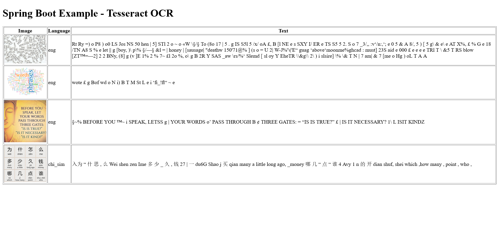

# Spring Boot Example - Tesseract OCR

## Description

A Java Spring Boot example how to use Tesseract for extracting text through Optical Character Recognition (OCR) from image files.

## Requirement

Requirements to run this code:

* JDK 17

* tesseract-ocr / tessdata <https://github.com/tesseract-ocr/tessdata>

* Environment variable "TESSDATA_PREFIX" pointing to **tessdata** folder.

* gradle

## Running

```powershell
gradle.bat bootRun
```

## Display

Open your browser at <http://localhost:8080/>

The page shown should be like,


